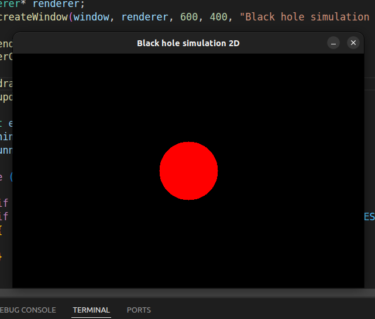
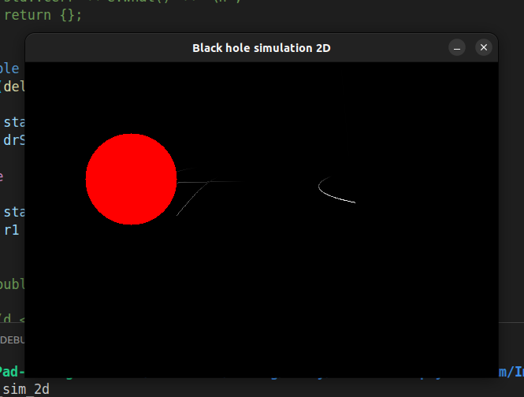

# Blackhole-Physics-Sim

## Blog

### 2026-03-12: Post 4 - First window and first photon

Getting a window open and drawing a circle was quite easy with SDL2. After that I implemented panning around with the mouse,
and getting the circle to represent a black hole, where the circles radius depends on the black hole's mass.

The photons themselves were more difficult, sometimes just converting between coordinate systems and other times fundamental failures in physics. Below you can see some of the first (and the most buggy) photons in the program, as you can see the photon to the right has done a U-turn before the black hole, very realistic...

### 2026-03-10: Post 3 - A rethinking of project

My first plan was creating this project in Unity, but after further thought and some programatic testing I changed direction. Since time is limited, and I'm not that proficent in Unity I have decided to change the program to be built with C++ and SDL2, since I am more comfortable with that.

I have since started work on the 2D version of the project and I am almost done with the null geodesic logic for the photon. Finding the turning point of a photon's path (determining the sign of $\frac{dr}{ds}$) has proven more difficult than expected but I will prevail...

### 2026-03-05: Post 2 - Background research

Since the last post I have basically only been trying to understand the subject, surprisingly (or maybe not so surprising) general relativity is quite diffcult to wrap your mind about.

To understand the math I have found some really good resourcs, the wikipedia page about the [Schwartzchild metric](https://en.wikipedia.org/wiki/Schwarzschild_geodesics#cite_ref-Schwarzschild_metric_3-0) had a really good outline how to model a photon orbiting a black hole using Runge-Kutta 4 for example.

With the use of wikipedia, a couple of lectures found online, and a couple of papers I was able to derive a form of the Schwartzchild solution of the geodesics equations useful for simulation using RK4.

Finding the math itself was actually the easier part, understandning it was way more difficult. In some cases (particularly understanding the impact parameter $b$) I made use of generative AI, where through a sort of socratic learning I was greatly helped.

### 2026-02-24: Post 1 - Hello, Space!

This is the final project for the course DD1354 Models and Simulation. This project will model a blackhole and how it bends space time altering the path of photons.

[Project specification](./report/project_specification.md)
