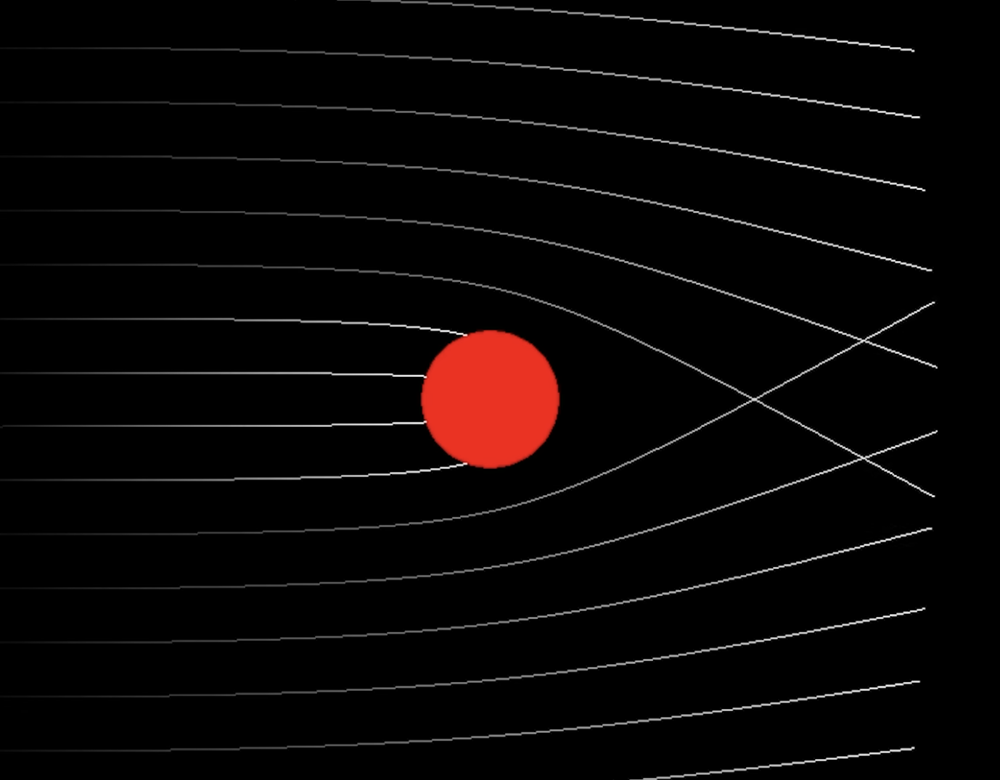

# Project specification
Creator: David Lindkvist, dalindk@kth.se

Grade aim: A

## 1. Some background to the area/problem

### Introduction
  Black holes are a type of exotic celestial object, with the key feature being their extreme mass, so massive not even light can escape its pull. 
  This makes for a very interesting subject, since as we know, light has no mass, so how does something massive "bend" the path of the light? 
  Quite literally of course, bending space itself.
  
  The aim of this project is to visualize this bending of space-time close to a Schwarzschild black hole. This will be controlled by modeling a 
  known phenomena that could be described as a looping mirror effect describe in [1]. Sending a photon from us, the observer, from a 
  specific point in a specfic direction will yield a path that loops once around the black hole returning to us, the observer.
  

  Since the warping of space-time is not something we usually think about in everyday life it can be quite difficult to understand.
  And due to this when we start to learn about a foreign subject like this we want to draw parallells to those things we know. This causes many
  visualizations of similar character to simplify the subject too much, such as reducing the effects of a black hole, just describing it using 
  newtonian physics. Some may state that they simulate photons when actually simulating particles with mass. This is wrong and part of this 
  project's aim is to improve upon these lacking visualizations. A Key take-away from this visualization should be that gravity does not act 
  like a force, it is instead a part of the geometry of space-time. Gravity does not effect photons, it effects the space the photons travel
  through, warping it.

  Inspiration for the project: [Simulating Black Holes in C++](https://www.youtube.com/watch?v=8-B6ryuBkCM)
  
  Interesting reads:
    - [Einstein-online](https://www.einstein-online.info/en/spotlight/)

### Background
  There are many physics and maths concepts neeeded to model an accurate black hole visualization.

  #### Key concepts:
  - Numeric methods (Euler central difference, RK4)
  - (Parts of) general theory of relativity
  - Geodesic equation (in the context of general relativity)
  - Schwartzchild metric
  - Weak Field Limit

## 2. Implementation specifics (as many as possible)
Technologies, physics problem, constraints

  The project will be made using the unity game engine. First a 2D version will be made to keep the scope of the project down, then if
  there's time for it, it may be expanded to 3D.

  #### Features:
  
  The Black hole representation
  - Defining the Schwarzschild Radius, as simple as defining the black hole with a certain mass.
  
  Tracing the path of photons (through warped space-time)
  - Solving geodesics equations (Einstein's equations) using numeric methods such as Euler central difference (or forward euler maybe) and
    Runge-Kutta-4 for more accurate results, in the context of the Schwartzchild metric.

## 3. Specifics of what the final system will look like
and do (include sketches if you like)

### Description

The system should be interactive in some way, to warrent a better understanding about how space-time warps near massive objects such as black 
holes. 

### Images 

(Simulating Black Holes in C++ by kavan)

## 4. References (2-3)
[1] F. Bacchini, B. Ripperda, A. Y. Chen, and L. Sironi, “Generalized, Energy-conserving Numerical Simulations of Particles in General Relativity. I. Time-like and Null Geodesics,” The Astrophysical Journal Supplement Series, vol. 237, no. 1, p. 6, Jul. 2018, doi: 10.3847/1538-4365/aac9ca.

## 5. Potential risks/challenges (And how they might be avoided/minimized)

  Risks: 
  - Scope creep
    Minimized by clearly defined project boundaries and the acceptance of not everything needs to be modeled, some things can just be mentioned
  - Ideas that are impossible to implement (though seem possible at the idea stage)
    Rapid and continuous iterative prototyping for the project, testing ideas for feasablity. 
  - 

## 6. Degree of simulation
To what degree will the simulation use existing physics
libraries versus being implemented from the ground up

  The majority of the physics will be made from the ground up. The scope of the project depends heavily on modern physics but does feature only 
  a few different concepts and formulas, that might as well be created from scratch for learning purposes. Physics Libraries for this do exist but
  in this case they may be a bit unnecessary. Maths libraries may be used for numerical methods since the need for speed is great if the project
  should be able to run in real time.
  

## 7. Link to blog containing first blog entry
[Link to blog](https://github.com/MrGreenScout/Blackhole-Physics-Sim/blob/main/README.md).
