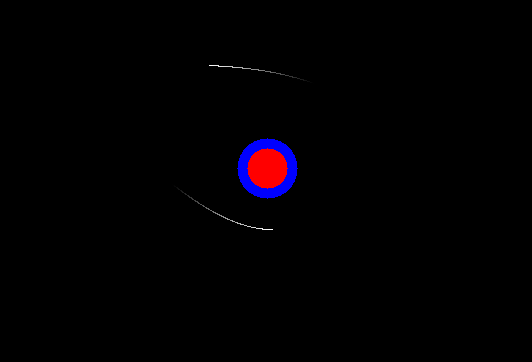

\pagebreak

\section*{Preface}

This project is so simple on the surface yet below it models very modern physics. To experience this program yourself you may use the following links:

- Github repository: 

  [https://github.com/MrGreenScout/Black-hole-physics-sim](https://github.com/MrGreenScout/Black-hole-physics-sim)

- Online simulation: 

  [https://mrgreenscout.github.io/Black-hole-physics-sim/](https://mrgreenscout.github.io/Black-hole-physics-sim/) 
  
  (disclaimer: may not be up to date with the native version on github)

Enjoy the read,

David Lindkvist, dalindk@kth.se

\pagebreak

\tableofcontents

\pagebreak

# Introduction
Black holes are a type of exotic celestial object, with the key feature being their extreme mass, so massive not even light can escape its pull. This makes for a very interesting subject, since as we know, light has no mass, so how does something massive "bend" the path of the light? Quite literally of course, bending space itself.
  
The aim of this project is to visualize this bending of space-time close to a Schwartzchild black hole by providing the user with the tools to spawn in photons with a specified position and direction. Since the warping of space-time is a concept not often thought about in everyday life it is often quite difficult to build up an intuitive understanding of it. Through experimentation with this program intuition may be built. For example, this program will build the understanding that light behaves differently to mass-particles, even though they may look similar at first glance.

To evaluate this program's accuracy compared to the underlying theory the report will perform a quantitative evaluation. The evaluation will test the accuracy of the stepping function of the simulation. This will be done by comparing the theoretical answer to if a photon should be absorbed, orbit or escape the black hole, and the outcome of the simulation for different initial values.

## Previous research

### The first image of a simulated black hole

The first image of a (simulated) black hole was created by Jean-Pierre Luminet in 1979. The image was produced using simulations run on a punch-card computer and visualized through a hand-plotted ink drawing. The illustration showed the shadow of the black hole, the luminous accretion disk and a visibly brighter side. The image combined the physical properties of a Schwartzchild black hole with an accretion disk made up of idealized particles emitting light. A notable feature of this image pointed out in [@Luminet2018] is the difference in luminosity between different regions on the disk, we the maximum luminosity appears near the event horizon, where the gas is hottest.

![Luminet's black hole image [@Luminet1979]](./img/luminets-black-hole.jpg)

### The first image of an actual black hole

One notable discovery was made in 2017 when the first image of an actual black hole was captured and later on published in 2019. Features seen in the simulation were confirmed to be present in real life. The image of the black hole both displays the shadow of the black hole and a luminous accretion disk [@Doeleman2019]. 

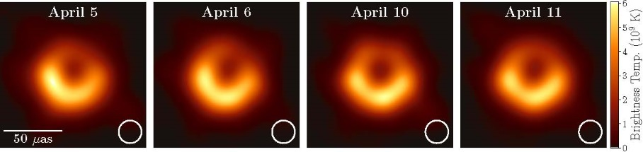

### Modern black hole simulations

Modern black hole simulations are used to produce data which can be compared with real life observations testing the current theories which aim to model the universe. These modern simulation run on super computers, one such simulation produced by the Simulating eXtreme Space-times, SXS, collaboration modelled what happens when two black holes merge to a bigger black hole causing a phenomena called gravitational waves, ripples in spacetime [@Clavin2023].

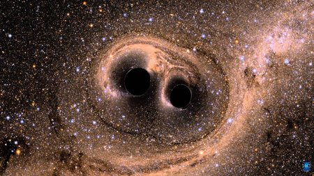

## Background

  There are many physics and maths concepts needed to model an accurate (but simplified) black hole simulation. The main physics problem this project aims to model is a photons movement close to a static black hole which requires solving a geodesic equation in the Schwartzchild metric. 
  
  The key concepts needed to build a black hole simulation are a numeric way of solving differential equations, parts of Einstein's general theory of relativity (including but not limited to geodesics equations) and the Schwartzchild metric.

### Runge-Kutta 4[^1]

  A prerequisite for programmatically bending light due to gravity is a numerical method that can be used to predict future position depending on current position and velocity. The method used in this project is the explicit Runge-Kutta 4 method, a fourth-order method that solves an equation of the form $\frac{dy}{dt}=f(t,y)$, $y(t_0)=y_0$ where $y$ is an unknown vector-valued function of a independet variable $t$.

  $y_{n+1}=y_n+\frac{h}{6}(k_1+2k_2+2k_3+k_4)$

  $t_{n+1}=t_n+h$ for $n=0,1,2,3,...$

  $k_1=f(t_n,y_n)$

  $k_2=f(t_n+\frac{h}{2},y_n+k_1\frac{h}{2})$

  $k_3=f(t_n+\frac{h}{2},y_n+k_2\frac{h}{2})$

  $k_4=f(t_n+h,y_n+hk_3)$

### Geodesics

  What is a geodesic? It is simply the locally shortest path (curve) between two points on a surface. 
  
  The full geodesic equation is as follows:

  $\frac{d^2 x^\mu}{ds^2}+\Gamma^\mu {}_{\alpha \beta}{d x^\alpha \over ds}{d x^\beta \over ds}=0$

  where $s$ is an affine parameter (a scalar that varies linearly along the path of the geodesic) and $\Gamma^\mu {}_{\alpha \beta}$ are Christoffel symbols symmetric in the two lower indices.

  The geometry of spacetime is 4 dimensional, denoted as 3+1 spacetime when there exists 3 spatial dimensions and 1 dimension of time. Therefore, the geodesics equation for spacetime explains the shortest distance between two "points" in time and space, more often called "events".

### The Schwartzchild metric

  In the case of the Schwartzchild metric, the geodesics equation is simplified by functionally removing all mass from the universe, and only modelling the external gravitational field of an uncharged, static, spherically symmetric body with a mass M, in our case a Schwartzchild black hole. The approximation is accurate enough for objects with small masses, or massless objects (such as photons).

  The Schwartzchild solution can be written as 
  
  $ds^2=c^2 {d \tau}^{2} = 
\left( 1 - \frac{r_\text{s}}{r} \right) c^{2} dt^{2} - \frac{dr^{2}}{1 - \frac{r_\text{s}}{r}} - r^{2} (d\theta^{2} + \sin^{2} \theta \, d\varphi^{2})$

  where
  * $ds^2$ is the spacetime distance, the distance between two events in both time and space
  * $\tau$ is the proper time in seconds (for particles with mass)
  * $c$ is the speed of light in m/s
  * $t$ is the time coordinate (for $r>r_s$)
  * $r$ is the radial coordinate (for $r>r_s$)
  * $\theta$ is the colatitude in radians
  * $\phi$ is the longitude in radians
  * $r_s$ is the Schwartzchild radius in meters $r_s=\frac{2GM}{c^2}$
  
  For something that travels at the speed of light,
  the spatial distance between two events is zero 
  (giving the name "null geodesic").

  Another simplification can be made, since the model describes a spherically symmetric mass, the gravity is the same in every direction. 

  Furthermore, a particle that is only influenced by one force, such as gravity, move in a 2D plane. Therefore, the colatitude can be thought of as $\theta = \pi / 2$.
  
  Then we can simplify the Schwartzchild solution:

  $ds^2= \left( 1 - \frac{r_\text{s}}{r} \right) c^{2} dt^{2} - \frac{dr^{2}}{1 - \frac{r_\text{s}}{r}} - r^{2} d\varphi^{2} = 0$

### Bending light for numerical solving[^2]

By adjusting the equation above we can get a solvable non-linear differential equation.

Dividing everything by $ds^2$, where $s$ is an affine parameter we get:

$\left( 1 - \frac{r_\text{s}}{r} \right) c^{2}(\frac{dt}{ds})^2 - \frac{1}{1 - \frac{r_\text{s}}{r}} (\frac{dr}{ds})^2 - r^{2} (\frac{d\varphi}{ds})^{2} = 0$

By analysing the geometry of the Schwartzfield metric we find two conserved quantities.

* $L$ is the angular momentum of the photon $L=r^2 \frac{d\varphi}{ds}$

* $E$ is the energy of the photon $E=(1-\frac{r_s}{r})\frac{dt}{ds}$

This gives rise to a parameter $b=\frac{L}{E}$, the impact parameter. Geometrically this is the perpendicular distance to the black hole from the photons asymptotic trajectory. $b=\frac{r^2}{(1-\frac{r_s}{r})}\frac{d\varphi}{dt}$

![Geometric explanation of b [@Luminet1979]](./img/Trajectory-of-photons.png)

\pagebreak

Switching to natural units[^3] (c = 1 and G = 1). Thus:

* $r_s=2M$

* $\left( 1 - \frac{r_\text{s}}{r} \right)(\frac{dt}{ds})^2 - \frac{1}{1 - \frac{r_\text{s}}{r}} (\frac{dr}{ds})^2 - r^{2} (\frac{d\varphi}{ds})^{2} = 0$

$\frac{d\varphi}{ds}=\frac{L}{r^2}$

$\frac{dt}{ds}=\frac{E}{(1-\frac{r_s}{r})}$

Substituting our definitions of $\frac{d\varphi}{ds}$ and $\frac{dt}{ds}$

$\left( 1 - \frac{r_\text{s}}{r} \right)(\frac{E}{(1-\frac{r_s}{r})})^2 - \frac{1}{1 - \frac{r_\text{s}}{r}} (\frac{dr}{ds})^2 - r^{2} (\frac{L}{r^2})^{2} = 0$

Simplifying the first and third terms

$\frac{E^2}{1-\frac{r_s}{r}} - \frac{1}{1 - \frac{r_\text{s}}{r}} (\frac{dr}{ds})^2 - \frac{L^2}{r^2} = 0$

Isolating $(\frac{dr}{ds})^2$

$(\frac{dr}{ds})^2 =E^2 - (1-\frac{r_s}{r})\frac{L^2}{r^2}$

This gives the derivatives used in Runge-Kutta 4:

$\frac{d\varphi}{ds}=\frac{L}{r^2}$

$\frac{dr}{ds} = \pm\sqrt{E^2 - (1-\frac{r_s}{r})\frac{L^2}{r^2}}$

where the sign of $\frac{dr}{ds}$ is determined by if the photon is radially in- or out-falling, where an out-falling photon has a positive change in $r$ and an infalling photon has a negative change in $r$ [@AliHaimoud2019].

### Applied RK4

let $\vec{y}(s)=\begin{pmatrix}
  r(s) \\
  \varphi(s)
\end{pmatrix}$

$f(s,\vec{y})=\frac{d\vec{y}}{ds}=\begin{pmatrix}
  \frac{dr}{ds} \\
  \frac{d\varphi}{ds}
\end{pmatrix}$ $=\begin{pmatrix}
    \pm\sqrt{E^2 - (1-\frac{r_s}{r})\frac{L^2}{r^2}} \\
    \frac{L}{r^2}
\end{pmatrix}$

Initial parameters are $\vec{y}(0) = \vec{y}_0$ and $\frac{d\vec{y}}{ds}|_{s=0, \vec{y}=y_0}=\dot{y}_0=\begin{pmatrix}
  \dot{r}_0 \\
  \dot{\varphi}_0
\end{pmatrix}$
This gives the constants:

$L=r_0^2\dot{\varphi}_0$ and

$E=\sqrt{\dot{r}_0^2+(1-\frac{r_s}{r})(\frac{L}{r_0})^2}$

This means $s$ is only implied, therefore $f$ is a function of $\vec{y}$, which means that the Runge-Kutta algorithm also is a function of just $\vec{y}$, $RK_4(\vec{y})$.

### Loop for stepping along the affine parameter

Let $\Delta(r)=(\frac{dr}{ds})^2=E^2 - (1-\frac{r_s}{r})\frac{L^2}{r^2}$

Calculate $\vec{y}_{n+1}=RK_4(\vec{y}_{n})$

if $\Delta(r)<0$ that is an unphysical state, seen as trying to take the square root of a negative number. If this happens that is a sign we have gone past a point where the photon should turn from being in-falling to out-falling, e.g. the sign of $\frac{dr}{ds}$ should change.

In the case of an unphysical state using the bisection method we find the $\vec{y}$ for which $\Delta(r)=0$ and  manually change the sign of $\frac{dr}{ds}$.

We then check if $r_n \leq r_s$, then we can stop stepping since the photon has been absorbed by the black hole else we can continue stepping from the newly calculated $\vec{y}_{n+1}$.

# Methods

The project was programmed in C++14 with the graphics library SDL2 for making a window and drawing graphics to the screen. The project was programmed and built on a Linux Machine running Ubuntu 22.04, using the g++ compiler for the native Linux build. To port to the web the Emscripten library was used, the compiler building to web was emcc. 

The physics was modelled using the built-in math library, no external physics library was used.

## Evaluating the simulation

To evaluate the model a quantitative method was chosen. 1000 photons are spawned evenly spaced out in the y direction with a set x position to the left of the black hole, and the same velocity going the right. For each photon the initial impact parameter is calculated from the angular momentum and energy of the photon. Two particular quantities are interesting for evaluating the model, that is the photon sphere radius and the critical impact parameter. As stated in [@Sneppen2021] the photon sphere is the radius at which a photon may orbit the black hole, a lower orbit results in a collision with the black hole and a higher orbit results in a escape trajectory. The photon sphere has a value of $r_{ph}=\frac{3}{2}R_s$ where $R_s$ is the Schwartzchild radius. The critical impact parameter $b_{crit}$ is the impact parameter distance within which a photon is captured, and outside it results in an escape trajectory.

\pagebreak

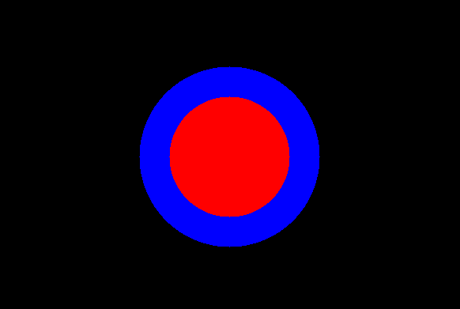

For visualization the photon sphere is interesting, since it clearly displays the boundary within which a photon is captured, and eventually absorbed. In the image above two circles are displayed, one red with the radius of the Schwartzchild radius and the blue representing the photon sphere.

\pagebreak

For each photon the impact parameter $b$ is calculated from the initial conditions.

$b < b_{crit}$ will result in a captured and eventually absorbed photon.

$b > b_{crit}$ will result in an escape trajectory.

(The edge case $b = b_{crit}$ has been accounted for by logging all photons that did not finish within a certain time frame determined per individual situation by the tester)

For each photon the expected outcome, absorbed or escaped is logged at initiation. As the photons complete their simulation, either escaping or getting absorbed, their final outcomes are logged. After all photons have finished, the expected results are compared to the simulated results.

### Initial values

All values are in natural units.

* $x = -100$
* $y \in [-20, 20]$
* $dx = 1$
* $dy = 0$

Since the impact parameter is defined as the perpendicular distance from the black hole if the photon traveled in flat space, the space at which the impact parameter can be accurately sampled at should be close to flat. For this simulation the space at 100 units from the black hole is deemed flat enough. Since for this setup $b \approx |y|$ for each photon, that value will be used since that is the $b$ expected for a photon coming in from infinitely away.

# Results

The aim of the project was to accurately visualize the bending of light near a black hole and by letting the user interact with the virtual world by spawning photons with customizable starting conditions. The resulting program represents a 2D cross-section of a universe only containing a Schwartzchild black hole. The user may pan and zoom around in this universe by using the mouse and, by right-click dragging and releasing, the user may create photons with a custom start position and direction. In [Appendix A](#appendix-a) the panning movement is depicted. In [Appendix B](#appendix-b) the zooming feature is depicted.

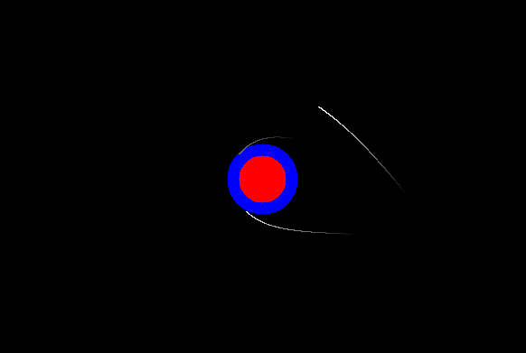

## Evaluation

The program was tested at the step sizes of $h \in [10, 1, 0.1, 0.01]$. [Appendix C](#appendix-c-evaluation) displays images from the test at $h = 0.1$

### Expected results

|  Expected outcome  |  Photons  |
| :---------------- | :-------: |
|      Escaped     |    740  |
|     Absorbed     |    260  |

### Actual results at different step lengths

| h | Simulated escaped | Simulated absorbed |
| :-: | :----------------: | :-----------------: |
|  10 |  770 |  230 |
|  1 |  740 |  260 |
|  0.1 |  740 |  260 |
|  0.01 |  740 |  260 |

# Discussion

## The development process

After the initial idea had been developed the specification process was mainly focused on translating the physics of the Schwartzchild metric to be solved numerically through code. Previous research suggested multiple ways of structuring the math for numerical solving, the solution that was chosen for this project was very closely related to the actual physics, and used only basic numerical methods for solving the geodesics equations. The chosen solution was discovered to be rather volatile and numerically unstable. This solution solved the equations purely numerically whereas another solution proposed in the wikipedia article for Schwartzchild geodesics [^4] suggested an analytic approach that would not need checks that would differentiate between in-falling and out-falling photons for example.

### Challenges

The aforementioned in/out-falling check proved a conundrum to structure. The unphysical state that needed to be controlled in this solution appeared as a negative sign under a square-root. This signaled that a photon should have changed from in- to out-falling, meaning the sign of $\frac{dr}{ds}$ should have changed. This solution needed the sign to be changed manually when $\frac{dr}{ds} = 0$. Detecting exactly when $\frac{dr}{ds}$ was zero was impossible but detecting when the previously defined $\Delta(r)<0$ was much more simple, but choosing when to do this check was difficult. The final solution chose to accept the unphysical state of $\Delta(r)$ being negative by instead of throwing an error clamping it to zero. This means that the Runge-Kutta approximation results in an unphysical state but by checking $\Delta(r)<0$ in the main stepping loop any unphysical state is accounted for before the state of the photon is confirmed.

## Evaluation

The results show that the program accurately simulates photons in regards to if they escape the black hole or get absorbed, suggesting the stepping is accurate. The results also show that a step size of $h = 10$ yields slightly inaccurate results, but an $h \leq 1$ passes the evaluation with a perfect score.

Since the evaluation method does not test all aspects of the simulation it only gives a good suggestion of the accuracy of the program. For example, the evaluation method disregards the accuracy of the photon paths only regarding the final outcome. A photon may escape too early or late, or follow an inaccurate trajectory that still result in the correct boolean outcome, escaped or absorbed.

## Further development

Due to the schwartzchild metric being geometrically symmetric, the photon always moving in a 2D slice of 3D space, the code that has been written in this program may be reused for simulating a photon moving in 3D space. This may give rise to more advanced physics simulations where accretion disks and other phenomena we see close to black holes may be more closely observed.

[^1]: [https://en.wikipedia.org/wiki/Runge%E2%80%93Kutta_methods](https://en.wikipedia.org/wiki/Runge%E2%80%93Kutta_methods)
[^2]: [https://en.wikipedia.org/wiki/Schwarzschild_geodesics](https://en.wikipedia.org/wiki/Schwarzschild_geodesics#cite_ref-Schwarzschild_metric_3-0)
[^3]: [https://en.wikipedia.org/wiki/Natural_units](https://en.wikipedia.org/wiki/Natural_units)
[^4]: [https://en.wikipedia.org/wiki/Schwarzschild_geodesics](https://en.wikipedia.org/wiki/Schwarzschild_geodesics#cite_ref-Schwarzschild_metric_3-0)

\pagebreak

# References

::: {#refs}
:::

\pagebreak

\section*{Appendix}

\subsection*{Appendix A: Panning}

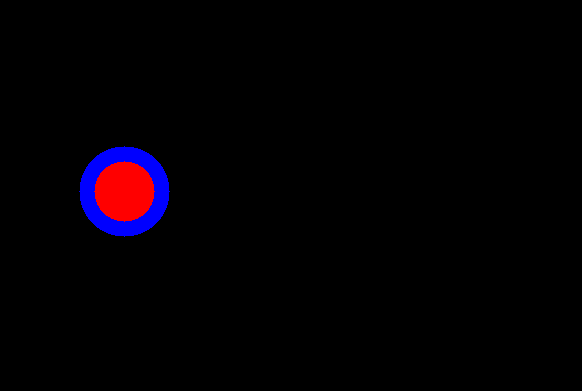\
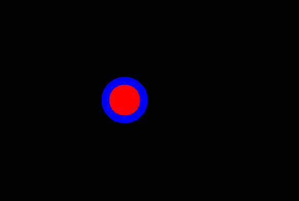\
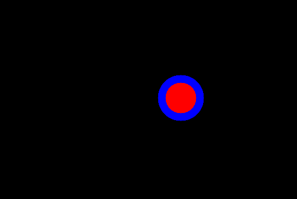\
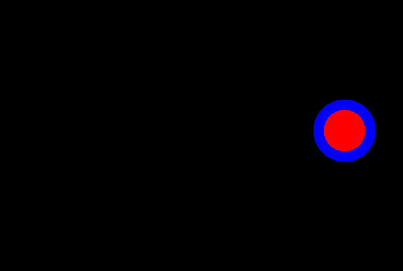\

\subsection*{Appendix B: Zooming}

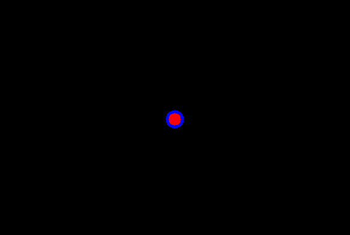\
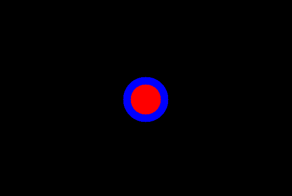\
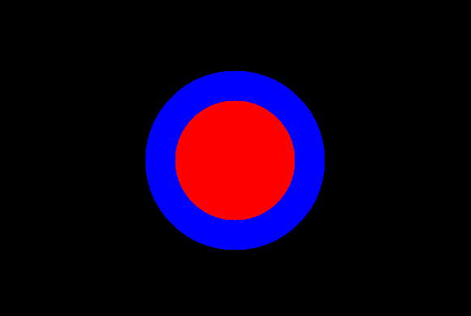\

\subsection*{Appendix C: Evaluation}

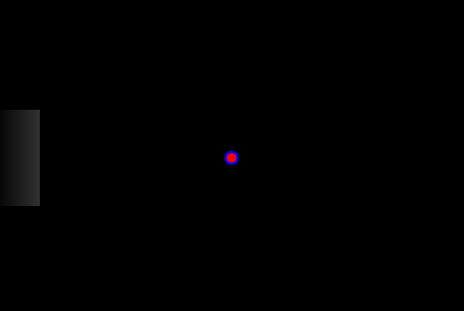\
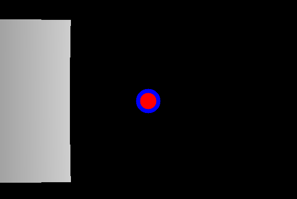\
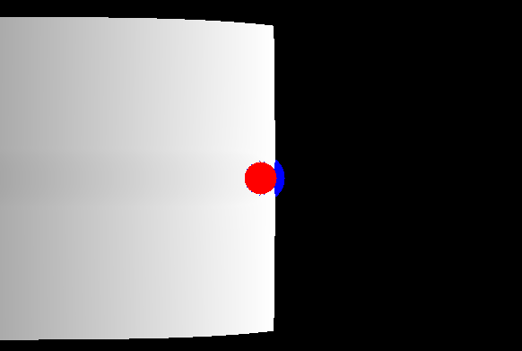\
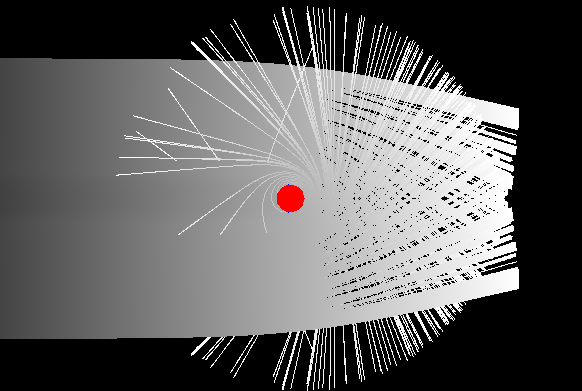\
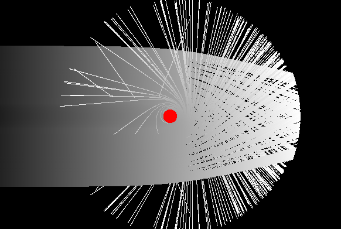\