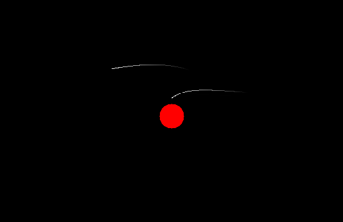

# Introduction
Black holes are a type of exotic celestial object, with the key feature being their extreme mass, so massive not even light can escape its pull. This makes for a very interesting subject, since as we know, light has no mass, so how does something massive "bend" the path of the light? Quite literally of course, bending space itself.
  
The aim of this project is to visualize this bending of space-time close to a Schwarzschild black hole. This will be controlled by modeling a known phenomena that could be described as a looping mirror effect specified in [@Bacchini2018]. Sending a photon from us, the observer, from a specific point in a specfic direction will yield a path that loops once around the black hole returning to us, the observer.

Since the warping of space-time is not something we usually think about in everyday life it can be quite difficult to understand. Due to this when we start to learn about a foreign subject we want to draw parallells to those things we know. This causes many visualizations of similar character to simplify the subject too much, such as reducing the effects of a black hole, just describing it using newtonian physics. Some may state that they simulate photons when actually simulating particles with mass. This is wrong and part of this project's aim is to improve upon these lacking visualizations. A Key take-away from this visualization should be that gravity does not act like a force, it is instead a part of the geometry of space-time. Gravity does not effect photons, it effects the space the photons travel through, warping it.

## Previous research

### The first image of a simulated black hole

The first image of a (simulated) black hole was created by Jean-Pierre Luminet in 1979. The image was produced using simulations run on a punch-card computer and visualized through a hand-plotted ink drawing. The illustration showed the shadow of the black hole, the luminous accretion disk and a visibly brighter side. The image combined the physical properties of a Schwartzchild black hole with an accretion disk made up of idealized particles emitting light. A notable feature of this image pointed out in [@Luminet2018] is the difference in luminosity between different regions on the disk, we the maximum luminosity appears near the event horizon, where the gas is hottest.

![Luminet's black hole image [@Luminet1979]](./img/luminets-black-hole.jpg)

### The first image of an actual black hole

One notable discovery was made in 2017 when the first image of an actual black hole was captured and later on published in 2019. Features seen in the simulation were confirmed to be present in real life. The image of the black hole both displays the shadow of the black hole and a luminous accretion disk [@Doeleman2019]. 

### Modern black hole simulations

Modern black hole simulations are used to produce data which can be compared with real life observations testing the current theories which aim to model the universe. These modern simulation run on super computers, one such simulation produced by the Simulating eXtreme Spacetimes, SXS, collaboration modelled what happens when two black holes merge to a bigger black hole causing a phenomena called gravitational waves, ripples in spacetime [@Clavin2023].

## Background

  There are many physics and maths concepts neeeded to model an accurate (but simplified) black hole simulation. The main physics problem this project aims to model is a photons movement close to a static black hole which requires solving a geodesic equation in the Schwartzchild metric. 
  
  The key concepts needed to build a black hole simulation are a numeric way of solving differential equations, parts of Einstein's general theory of relativity (including but not limited to geodesics equations) and the Schwartzchild metric.

### Runge-Kutta 4[^1]

  A prerequisite for programmatically bendning light due to gravity is a numerical method that can be used to predict future position depending on current position and velocity. The method used in this project is the explicit Runge-Kutta 4 method, a fourth-order method that solves an equation of the form $\frac{dy}{dt}=f(t,y)$, $y(t_0)=y_0$ where $y$ is an unknown vector-valued function of a independet variable $t$.

  $y_{n+1}=y_n+\frac{h}{6}(k_1+2k_2+2k_3+k_4)$

  $t_{n+1}=t_n+h$ for $n=0,1,2,3,...$

  $k_1=f(t_n,y_n)$

  $k_2=f(t_n+\frac{h}{2},y_n+k_1\frac{h}{2})$

  $k_3=f(t_n+\frac{h}{2},y_n+k_2\frac{h}{2})$

  $k_4=f(t_n+h,y_n+hk_3)$

### Geodesics

  What is a geodesic? It is simply the locally shortest path (curve) between two points on a surface. 
  
  The full geodesic equation is as follows:

  $\frac{d^2 x^\mu}{ds^2}+\Gamma^\mu {}_{\alpha \beta}{d x^\alpha \over ds}{d x^\beta \over ds}=0$

  where $s$ is an affine paramter (a scalar that varies linearly along the path of the geodesic) and $\Gamma^\mu {}_{\alpha \beta}$ are Christoffel symbols symmetric in the two lower indices.

  The geometry of spacetime is 4 dimensional, denoted as 3+1 spacetime when there exists 3 spatial dimensions and 1 dimension of time. Therefore, the geodesics equation for spacetime explains the shortest distance between two "points" in time and space, more often called "events".

### The Schwartzchild metric

  In the case of the Schwartzchild metric, the geodesics equation is simplified by functionally removing all mass from the universe, and only modelling the external gravitational field of an uncharged, static, spherically symmetric body with a mass M, in our case a Schwartzchild black hole. The approximation is accurate enough for objects with small masses, or massless objects (such as photons).

  The Schwartzchild solution can be written as 
  
  $ds^2=c^2 {d \tau}^{2} = 
\left( 1 - \frac{r_\text{s}}{r} \right) c^{2} dt^{2} - \frac{dr^{2}}{1 - \frac{r_\text{s}}{r}} - r^{2} (d\theta^{2} + \sin^{2} \theta \, d\varphi^{2})$

  where
  * $ds^2$ is the spacetime distance, the distance between two events in both time and space
  * $\tau$ is the proper time in seconds (for particles with mass)
  * $c$ is the speed of light in m/s
  * $t$ is the time coordinate (for $r>r_s$)
  * $r$ is the radial coordinate (for $r>r_s$)
  * $\theta$ is the colatitude in radians
  * $\phi$ is the longitude in radians
  * $r_s$ is the Schwartzchild radius in meters $r_s=\frac{2GM}{c^2}$
  
  For somethinge that travels at the speed of light,
  the spatial distance between two events is zero 
  (giving the name "null geodesic").

  Another simplification can be made, since the model describes a spherically symmetric mass, the gravity is the same in every direction. 

  Furthermore, a particle that is only influenced by one force, such as gravity, move in one 2D plane. Therefore, the colatitude can be thought of as $\theta = \pi / 2$.
  
  Then we can simplify the Schwartzchild solution:

  $ds^2= 
\left( 1 - \frac{r_\text{s}}{r} \right) c^{2} dt^{2} - \frac{dr^{2}}{1 - \frac{r_\text{s}}{r}} - r^{2} d\varphi^{2} = 0$

### Bending light for numerical solving[^2]

By adjusting the equation above we can get a solvable non-linear differential equation.

Dividing everything by $ds^2$, where $s$ is an affine parameter we get:

$\left( 1 - \frac{r_\text{s}}{r} \right) c^{2}(\frac{dt}{ds})^2 - \frac{1}{1 - \frac{r_\text{s}}{r}} (\frac{dr}{ds})^2 - r^{2} (\frac{d\varphi}{ds})^{2} = 0$

By analysing the geometry of the Schwartzfield metric we find two conserved quantities.
* $L$ is the angular momentum of the photon $L=r^2 \frac{d\varphi}{ds}$
* $E$ is the energy of the photon $E=(1-\frac{r_s}{r})\frac{dt}{ds}$

This gives rise to a parameter $b=\frac{L}{E}$, the impact parameter. Geometrically this is the perpendicular distance to the black hole from the photons asymptotic trajectory. $b=\frac{r^2}{(1-\frac{r_s}{r})}\frac{d\varphi}{dt}$

![Geometric explanation of b [@Luminet1979]](./img/Trajectory-of-photons.png)

Switching to natural units[^3] (c = 1 and G = 1). Thus:
* $r_s=2M$
* $\left( 1 - \frac{r_\text{s}}{r} \right)(\frac{dt}{ds})^2 - \frac{1}{1 - \frac{r_\text{s}}{r}} (\frac{dr}{ds})^2 - r^{2} (\frac{d\varphi}{ds})^{2} = 0$

$\frac{d\varphi}{ds}=\frac{L}{r^2}$

$\frac{dt}{ds}=\frac{E}{(1-\frac{r_s}{r})}$

Substituting our definitions of $\frac{d\varphi}{ds}$ and $\frac{dt}{ds}$

$\left( 1 - \frac{r_\text{s}}{r} \right)(\frac{E}{(1-\frac{r_s}{r})})^2 - \frac{1}{1 - \frac{r_\text{s}}{r}} (\frac{dr}{ds})^2 - r^{2} (\frac{L}{r^2})^{2} = 0$

Simplifying the first and third terms

$\frac{E^2}{1-\frac{r_s}{r}} - \frac{1}{1 - \frac{r_\text{s}}{r}} (\frac{dr}{ds})^2 - \frac{L^2}{r^2} = 0$

Isolating $(\frac{dr}{ds})^2$

$(\frac{dr}{ds})^2 =E^2 - (1-\frac{r_s}{r})\frac{L^2}{r^2}$

This gives the derivatives used in Runge-Kutta 4:

$\frac{d\varphi}{ds}=\frac{L}{r^2}$

$\frac{dr}{ds} = \pm\sqrt{E^2 - (1-\frac{r_s}{r})\frac{L^2}{r^2}}$

where the sign of $\frac{dr}{ds}$ is determined by if the photon is radially in- or outfalling, where an outfalling photon has a positive change in $r$ and an infalling photon has a negative change in $r$ [@AliHaimoud2019].

### Applied RK4

let $\vec{y}(s)=\begin{pmatrix}
  r(s) \\
  \varphi(s)
\end{pmatrix}$

$f(s,\vec{y})=\frac{d\vec{y}}{ds}=\begin{pmatrix}
  \frac{dr}{ds} \\
  \frac{d\varphi}{ds}
\end{pmatrix}$ $=\begin{pmatrix}
    \pm\sqrt{E^2 - (1-\frac{r_s}{r})\frac{L^2}{r^2}} \\
    \frac{L}{r^2}
\end{pmatrix}$

Initial parameters are $\vec{y}(0) = \vec{y}_0$ and $\frac{d\vec{y}}{ds}|_{s=0, \vec{y}=y_0}=\dot{y}_0=\begin{pmatrix}
  \dot{r}_0 \\
  \dot{\varphi}_0
\end{pmatrix}$
This gives the constants:

$L=r_0^2\dot{\varphi}_0$ and

$E=\sqrt{\dot{r}_0^2+(1-\frac{r_s}{r})(\frac{L}{r_0})^2}$

This means $s$ is only implied, therefore $f$ is a function of $\vec{y}$, which means that the Runge-Kutta algorithm also is a function of just $\vec{y}$, $RK_4(\vec{y})$.

### Loop for stepping along the affine parameter

Let $\Delta(r)=(\frac{dr}{ds})^2=E^2 - (1-\frac{r_s}{r})\frac{L^2}{r^2}$

Calculate $\vec{y}_{n+1}=RK_4(\vec{y}_{n})$

$\Delta(r)<0$ is an unphysical state, seen as trying to take the square root of a negative number. If this happens that is a sign we have gone past a point where the photon should turn from being infalling to outfalling, e.g. the sign of $\frac{dr}{ds}$ should change.

Using the bisection method we find the $\vec{y}$ for which $\Delta(r)=0$ and  manually change the sign of $\frac{dr}{ds}$.

We then check if $r_n \leq r_s$, then we can stop stepping since the photon has been absorbed by the black hole else we can continue steping from the newly calculated $\vec{y}_{n+1}$.

# Methods

The project was programmed in C++ with the graphics library SDL2 for making a window and drawing graphics.

# Results

# Discussion

[^1]: [https://en.wikipedia.org/wiki/Runge%E2%80%93Kutta_methods](https://en.wikipedia.org/wiki/Runge%E2%80%93Kutta_methods)
[^2]: [https://en.wikipedia.org/wiki/Schwarzschild_geodesics](https://en.wikipedia.org/wiki/Schwarzschild_geodesics#cite_ref-Schwarzschild_metric_3-0)
[^3]: [https://en.wikipedia.org/wiki/Natural_units](https://en.wikipedia.org/wiki/Natural_units)

# References

::: {#refs}
:::

# Appendix

## Appendix A